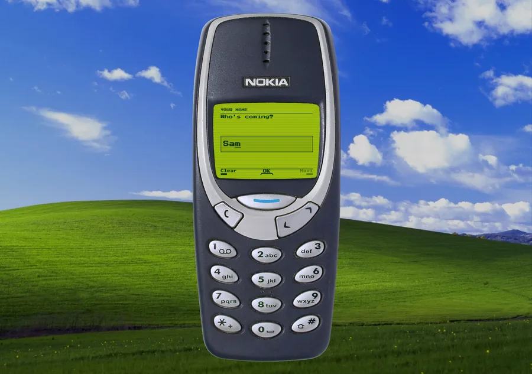

# Nokia 3310 UI

A button & screen overlay for the Nokia 3310 with built-in step functionality. You define a list of steps, each one is a screen, and people click through them on the keypad. Multi-tap and all, so typing your name takes a while again.

Text input, lists, a fake chat and a photo viewer are included, and you can write your own screens for the rest. Invitations, surveys, a quiz, a menu, a mini game, an about page, ...



## Getting started

```bash
pnpm install
pnpm dev
```

There is also `pnpm build`, `pnpm lint` and `pnpm typecheck`. pnpm is better, get used to it.

Two routes: `/` runs the flow, `/studio` is the calibration tool for fitting the key boxes to a photo if you were to map your own image.

## Configuring the flow

The example is a party invitation, in `config/invitation.tsx`. You are able to configure your own list of steps aswell or just override the existing demo. Each step is a kind of screen (see below) and holds its own content.

Steps need an `id` and a `type`. The `id` is what the answer comes back under, so a text step called `name` and a multiSelect called `nights` give you `{ name: "Sam", nights: ["2027-09-12"] }`. `onSubmit` receives that object when the flow reaches its confirm step, and the screen then shows sending, done or failed depending on what your promise does.

Type your flow as `BuiltinStep[]` and you get autocompletion per kind.

The background image behind the phone is set in the same file, as `BACKGROUND`. `BACKGROUND_DIM` darkens it if the phone gets hard to read against it.

## Screens

- `boot` a startup screen (advances by itself)
- `notice` a message that waits for OK
- `chat` texts that arrive one by one. Useful to display fake convo's.
- `photo` a picture, full screen
- `text` free text field
- `select` single list select
- `multiSelect` multi list select
- `confirm` confirmation modal & result

Most of what a screen shows is configurable per step: labels, prompts, hints, ... `confirm` also takes a `renderDone` if you want to write the ending yourself.

## Creating your own screens

For something the built-ins do not cover, copy a file from `components/screens/`, register it with `defineScreen`, and pass it to `PhoneFlow` under a new type name. A screen decides what its keys do in `handleKey` and what it draws in `render`.

## Fitting another photo

`/Studio` allows you to easily fit and map the buttons for other phone images.

Put your image in `public/img` and load it there. Drag each box onto its key, or nudge the selected one with the arrow keys, holding Shift for bigger steps. Test keys mode names the key you actually hit, which is the quickest way to
find one that is off. Copy the values into `config/skin.ts` when it lines up. The same panel sets the screen rectangle and the four screen colours.

`Shift+D` shows the boxes over the phone anywhere in the app.

## Keys

1 to 9 type, 0 is a space, `*` deletes, `#` commits a letter or finishes a list. Arrows are the Navi key, Enter is OK, Escape is C. Pass your own `keyMap` to remap, or `null` to turn the keyboard off.

You can also tab to a key and press Enter. The screen is a live region, so a screen reader announces it as it changes.

## Sound

Clicks and tones are generated at runtime, so there are currently no audio files. Pass `soundOptions` to `PhoneFlow` to set the volume, or to point at recordings if you would rather use your own.

## Licence

MIT. \
Not affiliated with Nokia. \
Or Microsoft. \
Or anything in particular.
